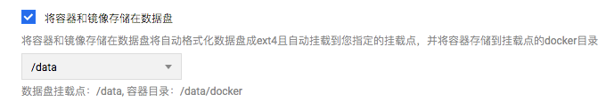
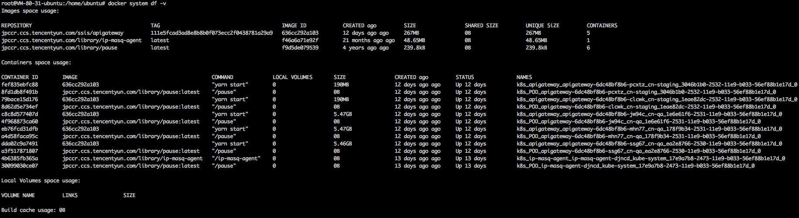
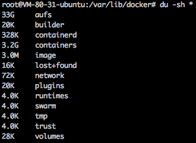
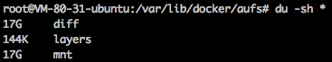
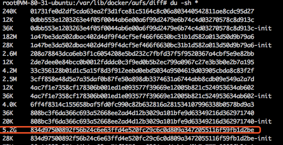
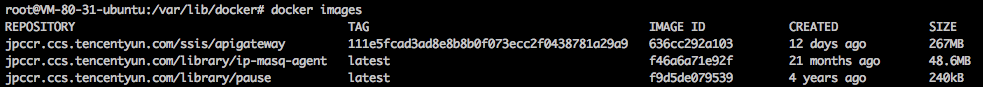

# 处理容器数据磁盘被写满

### 容器数据磁盘被写满造成的危害
- 不能创建 Pod (一直 ContainerCreating)
- 不能删除 Pod (一直 Terminating)

### 判断是否被写满
容器数据目录大多会单独挂数据盘，路径一般是 `/var/lib/docker`，也可能是 `/data/docker` 或 `/opt/docker`，取决于节点被添加时的配置：



可通过 `docker info` 确定：

``` bash
$ docker info
...
Docker Root Dir: /var/lib/docker
...
```

如果没有单独挂数据盘，则会使用系统盘存储。判断是否被写满：

``` bash
$ df
Filesystem     1K-blocks     Used Available Use% Mounted on
...
/dev/vda1       51474044  4619112  44233548  10% /
...
/dev/vdb        20511356 20511356         0 100% /var/lib/docker
```

### 解决方法
#### 先恢复业务，清理磁盘空间
重启 dockerd (清理容器日志输出和可写层文件)

- 重启前需要稍微腾出一点空间，不然重启 docker 会失败，可以手动删除一些docker的log文件或可写层文件，通常删除log:

``` bash
$ cd /var/lib/docker/containers
$ du -sh * # 找到比较大的目录
$ cd dda02c9a7491fa797ab730c1568ba06cba74cecd4e4a82e9d90d00fa11de743c
$ cat /dev/null > dda02c9a7491fa797ab730c1568ba06cba74cecd4e4a82e9d90d00fa11de743c-json.log.9 # 删除log文件
```
**注意:** 使用 `cat /dev/null >` 方式删除而不用 `rm`，因为用 rm 删除的文件，docker 进程可能不会释放文件，空间也就不会释放；log 的后缀数字越大表示越久远，先删除旧日志。

- 将该 node 标记不可调度，并将其已有的 pod 驱逐到其它节点，这样重启dockerd就会让该节点的pod对应的容器删掉，容器相关的日志(标准输出)与容器内产生的数据文件(可写层)也会被清理：

``` bash
kubectl drain 10.179.80.31
```
- 重启 dockerd:

``` bash
systemctl restart dockerd
```
- 取消不可调度的标记:

``` bash
kubectl uncordon 10.179.80.31
```
#### 定位根因，彻底解决
问题定位方法见附录，这里列举根因对应的解决方法：

- 日志输出量大导致磁盘写满:
  - 减少日志输出
  - 增大磁盘空间
  - 减小单机可调度的pod数量
- 可写层量大导致磁盘写满: 优化程序逻辑，不写文件到容器内或控制写入文件的大小与数量
- 镜像占用空间大导致磁盘写满:
  - 增大磁盘空间
  - 删除不需要的镜像

### 附录
#### 查看docker的磁盘空间占用情况

``` bash
$ docker system df -v
```



#### 定位容器写满磁盘的原因
进入容器数据目录(假设是 `/var/lib/docker`，并且存储驱动是 aufs):

``` bash
$ cd /var/lib/docker
$ du -sh *
```



- `containers` 目录: 体积大说明日志输出量大
-  `aufs` 目录


  - `diff` 子目录: 容器可写层，体积大说明可写层数据量大(程序在容器里写入文件)
  - `mnt` 子目录: 联合挂载点，内容为容器里看到的内容，即包含镜像本身内容以及可写层内容

#### 找出日志输出量大的 pod
TKE 的 pod 中每个容器输出的日志最大存储 1G (日志轮转，最大10个文件，每个文件最大100m，可用 `docker inpect` 查看):

``` bash
$ docker inspect fef835ebfc88
[
    {
         ...
        "HostConfig": {
            ...
            "LogConfig": {
                "Type": "json-file",
                "Config": {
                    "max-file": "10",
                    "max-size": "100m"
                }
            },
...
```
查看哪些容器日志输出量大：

``` bash
$ cd /var/lib/docker/containers
$ du -sh *
```


目录名即为容器id，使用前几位与 `docker ps` 结果匹配可找出对应容器，最后就可以推算出是哪些 pod 搞的鬼

#### 找出可写层数据量大的 pod
可写层的数据主要是容器内程序自身写入的，无法控制大小，可写层越大说明容器写入的文件越多或越大，通常是容器内程序将log写到文件里了，查看一下哪个容器的可写层数据量大：

``` bash
$ cd /var/lib/docker/aufs/diff
$ du -sh *
```


通过可写层目录(`diff`的子目录)反查容器id:

``` bash
$ grep 834d97500892f56b24c6e63ffd4e520fc29c6c0d809a3472055116f59fb1d2be /var/lib/docker/image/aufs/layerdb/mounts/*/mount-id
/var/lib/docker/image/aufs/layerdb/mounts/eb76fcd31dfbe5fc949b67e4ad717e002847d15334791715ff7d96bb2c8785f9/mount-id:834d97500892f56b24c6e63ffd4e520fc29c6c0d809a3472055116f59fb1d2be
```
`mounts` 后面一级的id即为容器id: `eb76fcd31dfbe5fc949b67e4ad717e002847d15334791715ff7d96bb2c8785f9`，使用前几位与 `docker ps` 结果匹配可找出对应容器，最后就可以推算出是哪些 pod 搞的鬼

#### 找出体积大的镜像
看看哪些镜像比较占空间

