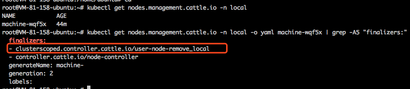

# Rancher 清除 Node 导致集群异常

## 现象
安装了 rancher 的用户，在卸载 rancher 的时候，可能会手动执行 `kubectl delete ns local` 来删除这个 rancher 创建的 namespace，但直接这样做会导致所有 node 被清除，通过 `kubectl get node` 获取不到 node，TKE 控制台也会显示这个集群节点全部异常。

## 原因
看了下rancher源码，rancher通过nodes.management.cattle.io这个CRD存储和管理node，会给所有node创建对应的这个CRD资源，metadata中加入了两个finalizer，其中"user-node-remove_local"对应的处理逻辑就是删除对应的k8s node资源，也就是 delete ns local 时，会尝试删除 nodes.management.cattle.io 这些CRD资源，进而触发 rancher 的 finalizer 逻辑去删除 对应的 k8s node 资源，从而清空了 node，所以kubectl get node就看不到node了，tke发现已添加的节点通过k8s api 全都无法 get 了，就显示全部异常。

## 规避方案
不要在rancher组件卸载完之前手动delete ns local