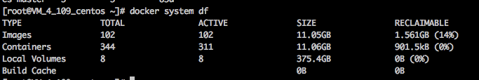
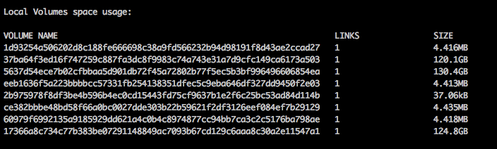
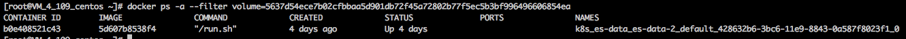
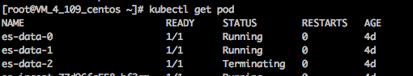
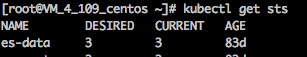

# 分析docker磁盘占用

有时候磁盘占用高但不知道被什么占用了，我们可以来分析下。

通过 `docker system df` 看磁盘主要被哪部分占用(镜像、容器、volume)



## local volume 占用高
- `docker system df -v` 查看哪些 volume 占用高

  

- 根据 volume id 反查容器:
  ``` bash
  docker ps -a --filter volume=5637d54ece7b02cfbbaa5d901db72f45a72802b77f5ec5b3bf996496606854ea
  ```
  

- `docker inspect` 一下容器，看被挂载的 volume 的挂载点是哪里，这里假设是 `/data`

- `docker inspect` 一下对应的镜像，里面应该也是声明了 volume 挂载点是  `/data`（Dockerfile 声明了挂载点 volume，如果启动容器并没有挂载外部数据卷到声明的挂载点，docker默认会在宿主机创建 `/var/lib/docker/volumes/<VOLUME-NAME>` 目录，并将其子目录 `_data` 挂载到容器里，而不是直接写到可写层 `/var/lib/docker/aufs/diff/` 下面）

- 通过 `k8s_es-data_es-data-2_default_428632b6-3bc6-11e9-8843-0a587f8023f1_0` 可分析这是 `default` 命名空间下 `es-data-2` 的pod所用到的容器

  

- 反查根源
  
  

- `kubectl describe` 或 `kubectl get -o yaml` 看下检查volume挂载点，如果是挂了外部数据卷，看是否是没有挂载到 Dockerfile 声明的 volume 挂载点  `/data` 下，如果挂错了就纠正挂载路径