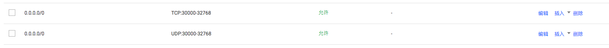

# LB 显示异常

通常是LB对绑定的后端节点进行健康检查探测时失败，我们来分析下原因

## Service 的 targetPort 不正确

Service 定义中的 targetPort 对应容器的端口，如果容器监听的是 8080，而 targetPort 写的 80，那么会不通，所以确保 targetPort 与容器监听的端口要一致。

## 节点安全组没放开 NodePort 区间

由于 TKE 的 LoadBalancer Service 基于 NodePort 实现，所以 LB 会绑定节点的 NodePort 端口(Service中的nodePort字段)，也就是 LB 会将请求直接发到节点的 NodePort 端口上，然后 k8s 内部再通过 kube-proxy 将数据包路由到对应的 pod 中。

通常节点安全组都对内网放开访问的，所以如果是内网LB一般不会这样，如果LB是公网类型，它对绑定的节点进行健康检查探测的源ip就是这个公网ip，而nodePort区间是30000-32768，所以节点安全组应该对 `0.0.0.0/0` 的 TCP 和 UDP 设为允许。

